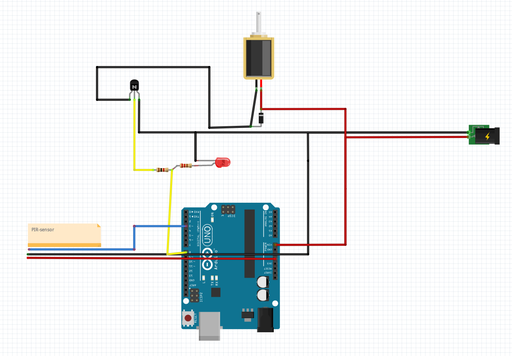

Kattvekk
========

Bruker en [Optex EX-35R](https://optexamerica.com/products/intrusion-detection/ex-35rc) til å 
reagere på bevegelser.

Sensoren kan stilles inn med to ulike sensitiviteter (2 pulse / 4 pulse) og Wide angle / Long range.

Sensoren drives i utgangspunktet av to stk AAA-batterier, men i dette prosjektet så drives den av 5v fra Arduino.

Sensorens NO-signal er koblet til arduino på pin 3. Når PIR-sensoren ser bevegelser så lukkes kretsen
og NO-signalet blir `HIGH`. Ellers er den `LOW`. I kretsen min drar jeg signalet til ground via motstand for å sikre
at verdien er `LOW` når kretsen er åpen, men usikker på hvor nødvendig dette er i og med at PIR-sensoren og arduino
har samme ground-referanse, og at PIR-sensoren mest sannsynlig drar signalet til `LOW` selv.

Når PIR-sensoren reagerer så åpnes en [vannventil](https://www.kjell.com/no/produkter/elektro-og-verktoy/elektronikk/arduino/arduino-tilbehor/vannventil-12-v-p87084)
på pin 8, via en TIP 120-transistor. Det er 1k motstand mellom pin8 og transistorens `Base`. 
`Emitter` er koblet til ground og `Collector` er koblet til vannventilen. 

Vannventilen er koblet til 12v, som også driver Arduino via `VIN`-porten.

På tvers av vannventilens koblinger går det en 1n4007-diode (katode mot pluss-kobling / diode mot minus).

